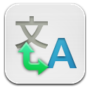
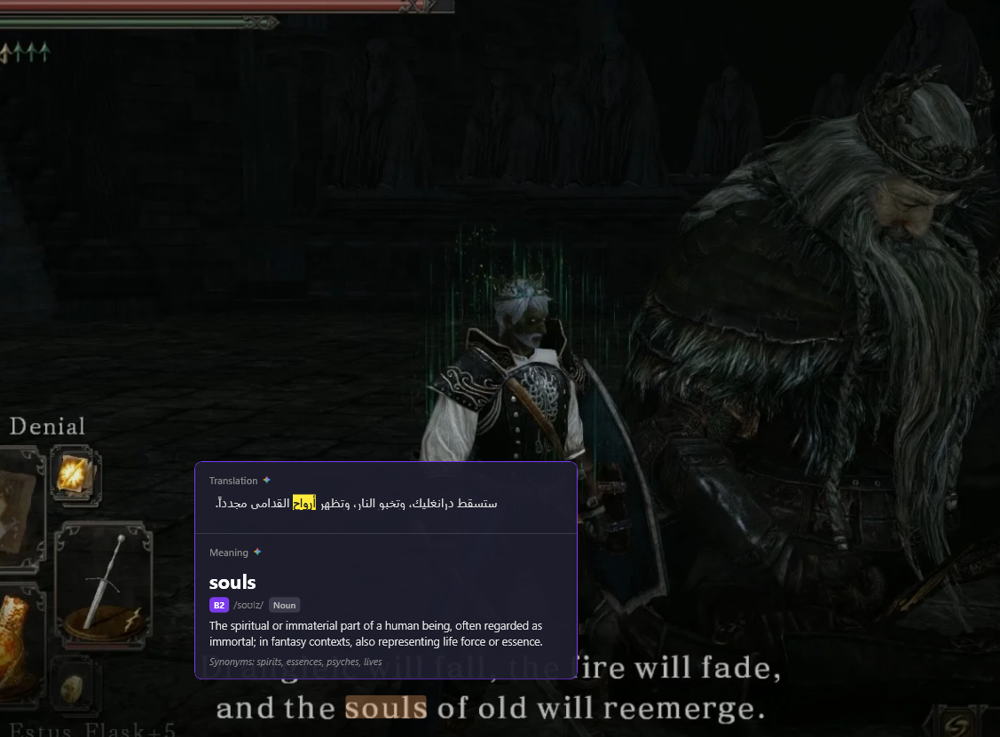

<p align="center">
  
</p>

<h1 align="center">Tarjem</h1>

<p align="center">
  <b>Screen translator overlay</b><br/>
  Hover a word, press <kbd>Alt</kbd>+<kbd>Q</kbd>, and get an instant translation.<br/>
  Drag a box with <kbd>Alt</kbd>+<kbd>W</kbd> to translate everything inside it.<br/>
  Hit <kbd>Alt</kbd>+<kbd>E</kbd> on a name to find out what it actually is.
</p>

<p align="center">
  
  
  
  
</p>

<p align="center">
  
</p>

## How it works

Tarjem reads the word under your cursor with the OCR built into Windows, then asks the best
available source what it means and what it says in your language. It works the moment it's
installed — the default sources need no API key and no account.

**Nothing is a single point of failure.** Every lookup walks a chain of sources: the one you
chose first, then the next best. If a service is down or rate-limited, the answer quietly comes
from somewhere else instead of failing, and your setting is never rewritten behind your back.

| | Sources |
|---|---|
| **Definitions** | FreeDictionaryAPI · dictionaryapi.dev · Wiktionary · Gemini · Merriam-Webster |
| **Translation** | Google Translate · Gemini · Groq · Cerebras · Lingva · MyMemory |
| **Names** | Wikipedia — for "NVIDIA" and other words no dictionary carries |

AI translation is *transcreation*, not word-for-word: the sentence is rewritten the way a native
speaker would have said it.

## Shortcuts

| | |
|---|---|
| <kbd>Alt</kbd>+<kbd>Q</kbd> | Translate the word under the cursor, in the context of its sentence |
| <kbd>Alt</kbd>+<kbd>W</kbd> | Drag a box; everything inside it is translated in place |
| <kbd>Alt</kbd>+<kbd>E</kbd> | "What is this?" — asks Wikipedia about the word under the cursor, and translates the answer |

All three are rebindable in Settings.

**Or don't use a shortcut at all.** Turn on *Button when you select text* and selecting anything —
in a browser, a PDF, a document — puts a small Tarjem button beside it. This is the most accurate
path in the app, because it works from the real text instead of from pixels: none of OCR's
merged-glyph or split-word failure modes apply. Off by default, since it means watching for
selections.

## Vocabulary

Every Alt+Q lookup is saved with its definition, translation, CEFR level and the sentence it came
from. **Export** on the History page writes that out as an Anki deck (tab-separated, with the
import directives already set) or a CSV.

## Languages

18 languages both ways — including English itself as a target, so you can read Japanese and get
English out — with Arabic, Persian and Urdu rendered right-to-left in IBM Plex Sans Arabic.
Reading a language other than English needs its Windows OCR pack installed (Windows Settings →
Time & language → Language & region).

## Building

```
dotnet build Tarjem.csproj
dotnet test Tarjem.Core.Tests/Tarjem.Core.Tests.csproj
dotnet test Tarjem.UiTests/Tarjem.UiTests.csproj
```

Packaging with bundled API keys: put them in a `.env` beside the built exe, run
`Tarjem.exe --pack-keys`, delete the `.env`, then build the installer. See `API-KEYS-TO-GET.txt`
and `SECURITY.md` — **never put a key in a `.cs` file.**

## Your data

Everything stays on your machine, in `%LOCALAPPDATA%\Tarjem\`:

| File | Description |
|------|-------------|
| `settings.json` | App settings — plaintext, and deliberately holds no secrets |
| `history.json` | Lookup history (can be turned off entirely) |
| `keys.dat` | Every API key, yours and the shipped ones, encrypted with Windows DPAPI |
| `logs/` | Log files (7-day rolling) |

The only thing that leaves is the word or region being translated, sent to the source you picked.

## More

- [`SECURITY.md`](SECURITY.md) — key handling, and the 2026-08 leaked-key incident
- [`FUTURE-WORK.md`](FUTURE-WORK.md) — offline mode, PaddleOCR, and what was deferred and why
